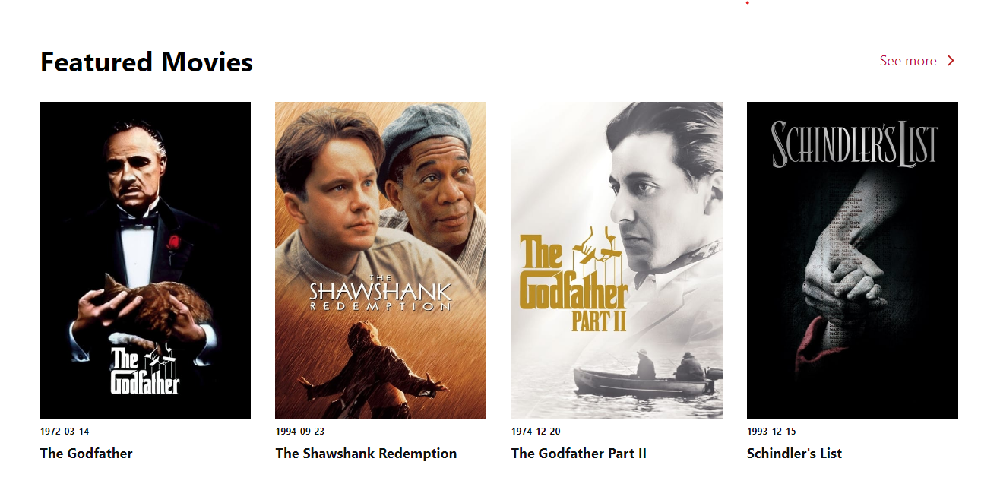

# HNG Internship - Movie Discovery Web App

This is the Solution to the Stage Two Project On HNG Internship Program

## Overview

A movie web app for discovering movies

### Screenshot

### Link

- Live Site URL: [Vercel](https://hng-stage-two-virid.vercel.app/)

## My process

I approached the project by going to TMDB to get my API KEY then quickly tested the API to see if it's working, before going on t build the project.

### Built with

- Semantic HTML5 markup
- Flexbox
- Grid
- Mobile-first workflow
- React
- TMDB API

## Author

- Twitter - [@jeremiahchinwe](https://www.twitter.com/jeremiahchinwe)

